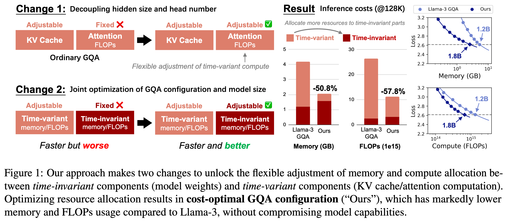
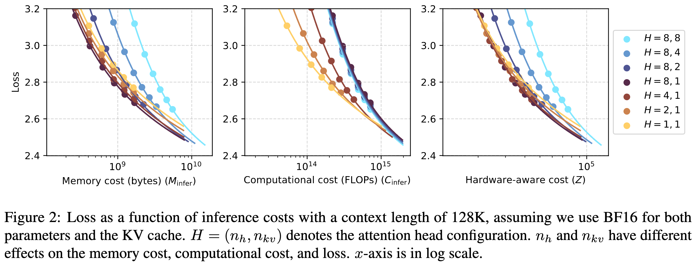

<h1 align="center">Cost-Optimal Grouped-Query Attention for Long-Context Modeling</h1>

<div align="center">
  <a href="https://huggingface.co/collections/chen-yingfa/cost-optimal-gqa-models-68c685bab808768393c9aa39">🤗 Models</a> |
  <a href="https://arxiv.org/abs/2310.05963">Paper (arXiv)</a>
</div>
</br>

<div align="center">
  <span style="font-weight: bold;">Yingfa Chen*, Yutong Wu*, Chenyang Song, Zhen Leng Thai, Xingyu Shen, Xu Han, Zhiyuan Liu, Maosong Sun</span> </br>
  Tsinghua University, University of Science and Technology Beijing</br>
  <span style="font-family: monospace;">chenyingfa1999@gmail.com, wuyutong_yuna@163.com</span> </br></br>
</div>

This repository contains the code and models used in the EMNLP 2025 paper [Cost-Optimal Grouped-Query Attention for Long-Context Modeling](https://arxiv.org/abs/2503.09579).

## Main Results

The main research question of the paper:
<div align="center" style="padding: 0px 40px; font-style: italic;">Given an expected inference context
length and target loss, how can GQA be
configured to minimize inference costs
while achieving that loss?*
</div>
</br>

To avoid sweeping all combinations of model sizes and GQA configurations, we present a threestep search procedure. Our approach is empirically validated on models up to 1.2B parameters. Empirical results show that the widely used Llama-3 GQA configuration (Grattafiori et al., 2024) is highly suboptimal at 128K (which is the context length supported by Llama-3).





## How to Run the Code

Please refer to the README.md file inside the `src` folder.

## How to Cite

```bibtex
@inproceedings{chen2025cost-optimal-gqa,
    title={Cost-Optimal Grouped-Query Attention for Long-Context Modeling}, 
    author={Yingfa Chen and Yutong Wu and Chenyang Song and Zhen Leng Thai and Xingyu Shen and Xu Han and Zhiyuan Liu and Maosong Sun},
    year={2025},
    booktitle={Proceedings of the 2025 Conference on Empirical Methods in Natural Language Processing (EMNLP)},
}
```
